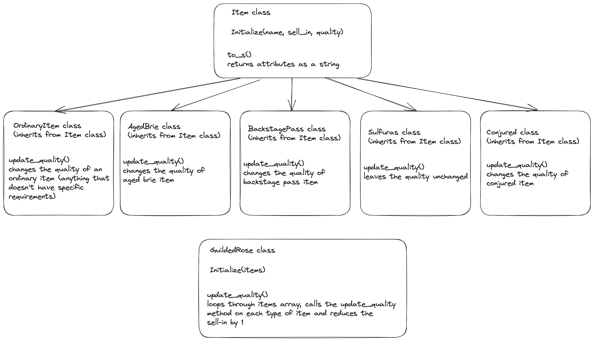

# Gilded Rose

A refactoring challenge originally created by Terry Hughes (http://twitter.com/TerryHughes) and translated into Ruby by Emily Bache [here](https://github.com/emilybache/GildedRose-Refactoring-Kata/blob/main/README.md).

## The task

To create a test suite for a legacy code, refactor the code and add a new feature.

The text of the kata (also found [here](https://github.com/emilybache/GildedRose-Refactoring-Kata/tree/master/GildedRoseRequirements.txt)):

======================================
Gilded Rose Requirements Specification
======================================

Hi and welcome to team Gilded Rose. As you know, we are a small inn with a prime location in a
prominent city ran by a friendly innkeeper named Allison. We also buy and sell only the finest goods.
Unfortunately, our goods are constantly degrading in quality as they approach their sell by date. We
have a system in place that updates our inventory for us. It was developed by a no-nonsense type named
Leeroy, who has moved on to new adventures. Your task is to add the new feature to our system so that
we can begin selling a new category of items. First an introduction to our system:

    - All items have a SellIn value which denotes the number of days we have to sell the item
    - All items have a Quality value which denotes how valuable the item is
    - At the end of each day our system lowers both values for every item

Pretty simple, right? Well this is where it gets interesting:

    - Once the sell by date has passed, Quality degrades twice as fast
    - The Quality of an item is never negative
    - "Aged Brie" actually increases in Quality the older it gets
    - The Quality of an item is never more than 50
    - "Sulfuras", being a legendary item, never has to be sold or decreases in Quality
    - "Backstage passes", like aged brie, increases in Quality as its SellIn value approaches;
    Quality increases by 2 when there are 10 days or less and by 3 when there are 5 days or less but
    Quality drops to 0 after the concert

We have recently signed a supplier of conjured items. This requires an update to our system:

    - "Conjured" items degrade in Quality twice as fast as normal items

Feel free to make any changes to the UpdateQuality method and add any new code as long as everything
still works correctly. However, do not alter the Item class or Items property as those belong to the
goblin in the corner who will insta-rage and one-shot you as he doesn't believe in shared code
ownership (you can make the UpdateQuality method and Items property static if you like, we'll cover
for you).

Just for clarification, an item can never have its Quality increase above 50, however "Sulfuras" is a
legendary item and as such its Quality is 80 and it never alters.

## Learning objectives

- Class design in Ruby
- TDD with RSPEC
- Refactoring legacy code

## Design

The code has been refectored to utilise individual classes for each type of Item.

Each new class inherits from the original Item class and adds a method update_quality which implements it;s own specific quality change rules.

The original GuildedRose class has been updated to simply call the update_quality method on each item and reduce the sell_in by 1.

Class design plan:


## Setup

```zsh
bundle install

# To get details tests and test coverage:
rspec
```

## Built with

#### Languages used:

- Ruby

#### Testing environment:

- RSPEC

## Example

```ruby
# irb -r ./gilded_rose.rb

items = [OrdinaryItem.new('ordinary item', 50, 40)]
GildedRose.new(items).update_quality
items[0].quality # returns 39
```
